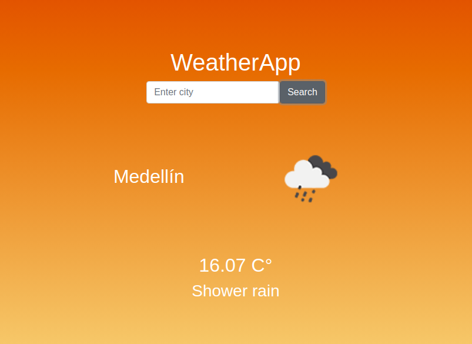

# Project Name

> This is a Weather App built using OpenWeatherMap API, JavaScript, Bootstrap, and Webpack.

> This app lets you know the current weather in an specified city, it shows city name, temperature, an icon referred to the actual weather and a description of the weather.

## Built With

- JavaScript
- OpenWeather
- Bootstrap
- HTML
- CSS
- Webpack

## Live Demo

[Live Demo Link](https://jssarrazolaa.github.io/JS-WeatherApp/)

## Getting Started

To get a local copy up and running follow these simple example steps:

- Open your terminal and run this command `git clone https://github.com/jssarrazolaa/JS-WeatherApp.git`

### Prerequisites

- NodeJs
- Webpack
- Eslint
- Stylelint
- Hintrc

## Authors

👤 **Author1**

- GitHub: [@jssarrazolaa](https://github.com/jssarrazolaa)
- Twitter: [@StevenAlvarez_](https://twitter.com/StevenAlvarez_)
- LinkedIn: [Jhonatan Sarrazola](https://www.linkedin.com/in/jhonatansarrazola/)

## 🤝 Contributing

Contributions, issues, and feature requests are welcome!

Feel free to check the [issues page](https://github.com/jssarrazolaa/JS-WeatherApp/issues).

## Show your support

Give a ⭐️ if you like this project!

## Acknowledgments

- The Odin Project
- Microverse
- OpenWeatherMap

## 📝 License

This project is [MIT](lic.url) licensed.
